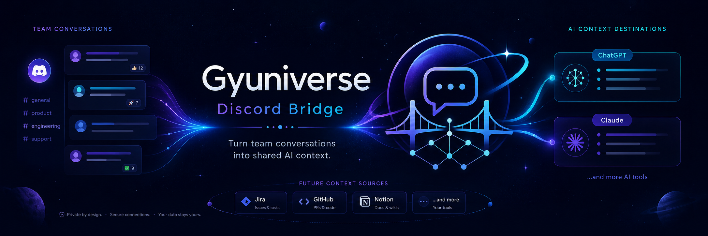
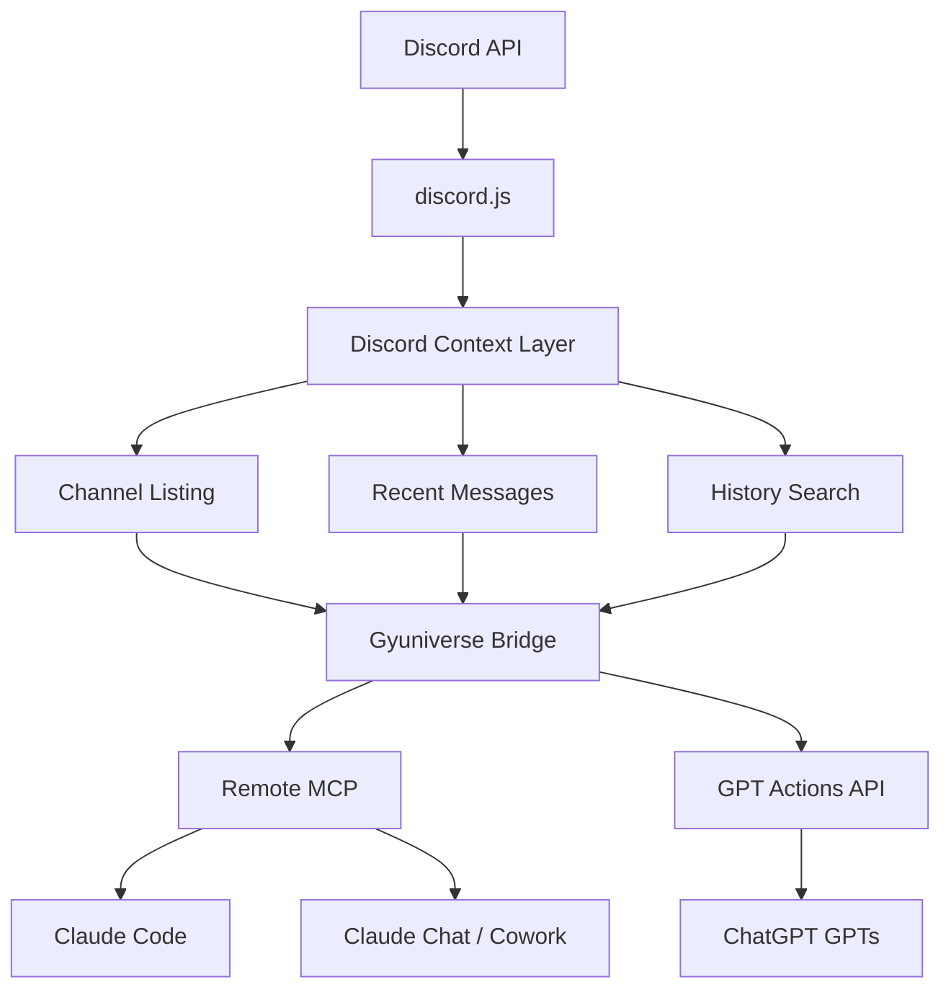
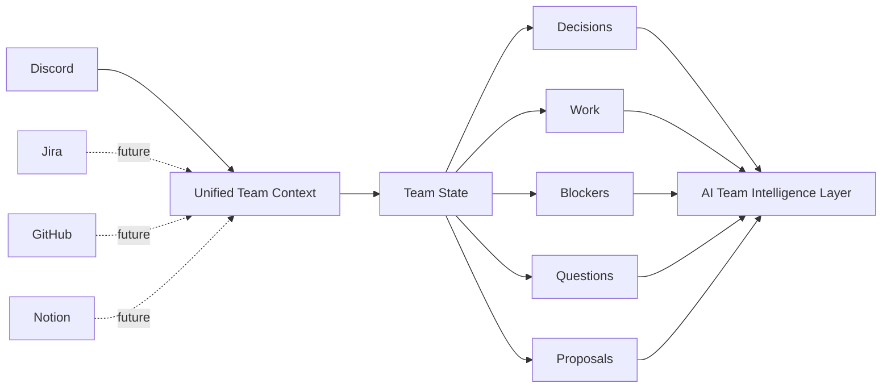
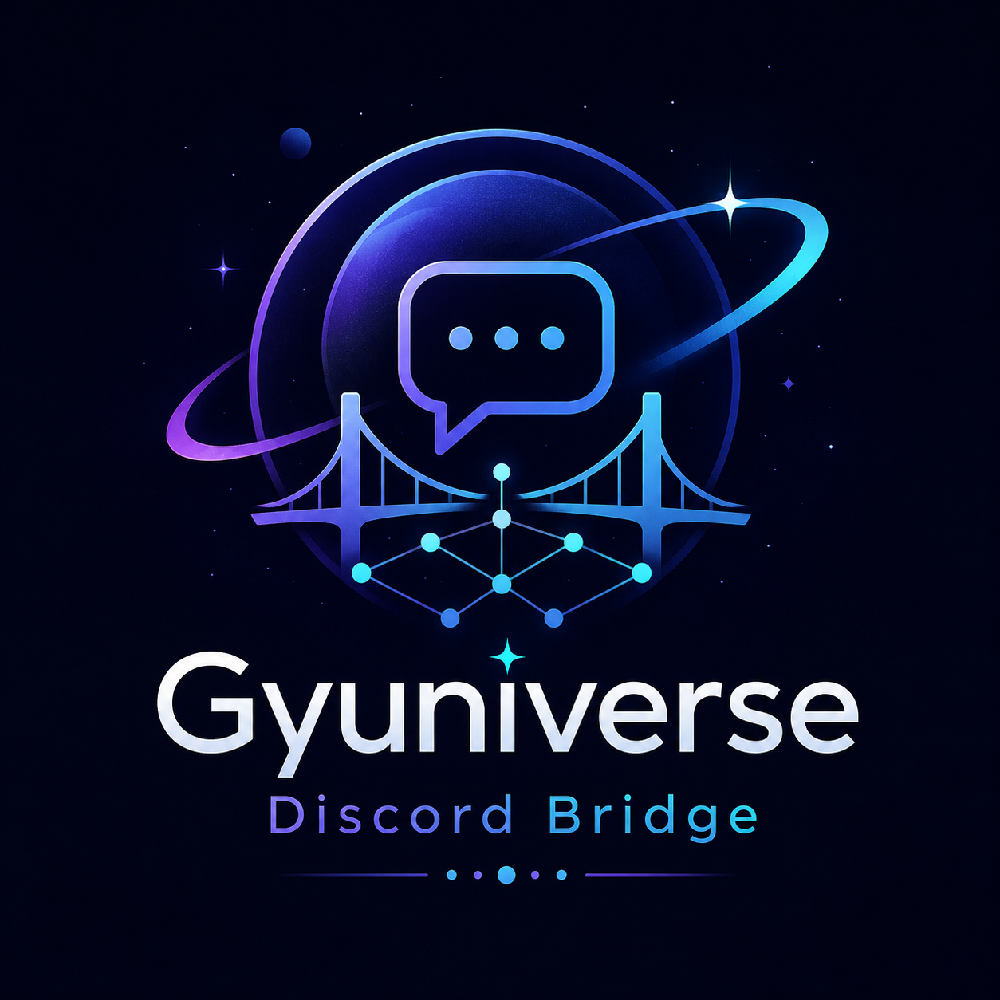

<div align="center">



<br/>

<p>
  
  
  
  
</p>

<p>
  
  
  
  
</p>

**Discord → Bridge → AI**  
한 번 연결한 팀 Discord를 여러 AI 클라이언트에서 **공용 팀 컨텍스트**로 활용합니다.

[⚡ Quick Start](#-quick-start) · [✨ Features](#-features) · [💡 Use Cases](#-use-cases) · [🏗 Architecture](#-architecture) · [📚 Docs](#-docs) · [🔐 Security](#-security)

</div>

---

## 👀 At a glance

<table>
<tr>
<td width="33%" valign="top">

### 💬 Read Discord

채널 목록, 최근 메시지, 과거 대화를 읽고 검색합니다.

</td>
<td width="33%" valign="top">

### 🧠 Understand Context

결정, 작업, Blocker, 질문, 제안을 AI가 구조화할 수 있습니다.

</td>
<td width="33%" valign="top">

### 🔌 Use Anywhere

ChatGPT GPTs, Claude Code, Claude Chat / Cowork에서 같은 팀 컨텍스트를 사용합니다.

</td>
</tr>
</table>

```text
                         Team Discord
                              │
                       Discord Bot 1개
                              │
                              ▼
                 ┌─────────────────────────┐
                 │  Gyuniverse Bridge      │
                 │  Discord → AI Context   │
                 └────────────┬────────────┘
                              │
                ┌─────────────┼─────────────┐
                │             │             │
                ▼             ▼             ▼
          ChatGPT GPTs   Claude Code   Claude Chat / Cowork
           GPT Actions    Remote MCP       OAuth MCP
```

> **핵심 목표**  
> Discord를 단순 채팅 로그가 아니라, AI가 다시 읽고 판단 근거로 사용할 수 있는 **Team Context Source**로 만드는 것.

---

## ✨ Features

| Status | 기능 | 설명 |
| :---: | --- | --- |
| ✅ | 채널 목록 조회 | Bot이 접근 가능한 Discord 채널 확인 |
| ✅ | 최근 메시지 조회 | 특정 채널의 최신 대화 조회 |
| ✅ | 과거 메시지 검색 | 키워드 기반 Discord 히스토리 검색 |
| ✅ | 팀 상태 브리핑 | 결정 · 작업 · Blocker · 질문 · 제안 구조화 |
| ✅ | Evidence 기반 분석 | 실제 Discord 메시지를 근거로 AI 답변 구성 |
| ✅ | Multi-client | ChatGPT / Claude에서 동일한 팀 컨텍스트 사용 |

### Intentionally Read-Only

현재 Bridge는 Discord에 **쓰기 권한을 제공하지 않습니다.**

```text
❌ 메시지 작성
❌ 메시지 수정
❌ 메시지 삭제
```

AI가 **팀 대화를 읽는 것**과 **팀 공간을 조작하는 것**을 분리합니다.

---

## ⚡ Quick Start

### Production Endpoint

```text
https://gyuniverse-discord-bridge.vercel.app/mcp
```

| Client | Connection | Authentication | Status |
| --- | --- | --- | :---: |
| ChatGPT GPTs | GPT Actions / OpenAPI | Bearer API Key | ✅ |
| Claude Code | Remote HTTP MCP | Bearer Secret | ✅ |
| Claude Chat | Custom Connector | OAuth + DCR + PKCE | ✅ |
| Claude Cowork | Claude Connector | OAuth Connector | 🧪 |

<details>
<summary><b>🟢 ChatGPT GPTs 연결</b></summary>

<br/>

```text
OpenAPI Schema
https://gyuniverse-discord-bridge.vercel.app/api/gpt/openapi

Authentication
API Key → Bearer
```

설정 흐름:

```text
GPT 편집
→ Configure
→ Actions
→ Create new action
→ Import from URL
```

정상 연결 시 Action:

```text
listDiscordChannels
getRecentDiscordMessages
searchDiscordMessages
```

</details>

<details>
<summary><b>🟠 Claude Code 연결</b></summary>

<br/>

```powershell
$env:GYUNIVERSE_MCP_TOKEN = "<MCP_SHARED_SECRET>"
claude mcp add --transport http gyuniverse-discord https://gyuniverse-discord-bridge.vercel.app/mcp --header "Authorization: Bearer $env:GYUNIVERSE_MCP_TOKEN"
```

연결 확인:

```powershell
claude mcp list
```

정상 연결 시 Tool:

```text
list_discord_channels
get_recent_discord_messages
search_discord_messages
```

</details>

<details>
<summary><b>🟠 Claude Chat / Cowork 연결</b></summary>

<br/>

```text
Customize
→ Connectors
→ Add custom connector

Name
Gyuniverse Discord

MCP Server URL
https://gyuniverse-discord-bridge.vercel.app/mcp

Authentication
항상 필요

OAuth Client
클라이언트 ID 없음 — 자동 등록
```

현재 OAuth Scope:

```text
discord:read
```

</details>

상세 연결 가이드: [`docs/TEAM_AI_CONNECTION_QUICKSTART.md`](docs/TEAM_AI_CONNECTION_QUICKSTART.md)

---

## 💡 Use Cases

### 최근 대화 요약

```text
노트-자원 채널 최근 메시지 20개 읽어서 중요한 내용만 요약해줘.
```

### 과거 논의 검색

```text
Discord 전체에서 Jira가 언급된 과거 메시지를 찾아줘.
작성자, 채널, 시간과 함께 중요한 내용만 정리해줘.
```

### 현재 팀 상태 브리핑

```text
Discord를 확인해서 현재 팀 상황을
확정된 결정 / 진행 중 작업 / 담당 작업 / Blocker / 미응답 질문 / 미확정 제안
으로 나눠서 정리해줘.
```

### Decision Baseline 대조

```text
최근 Discord 대화를 기존 Decision Baseline과 대조해서
확정된 결정과 아직 열린 제안을 구분해줘.
```

### 변경 사항 추적

```text
지난 24시간 동안 새 결정, 변경된 결정, 새 작업,
진행 변화, Blocker, 질문, 제안만 정리해줘.
```

---

## 🧠 Why this exists

팀 프로젝트의 중요한 정보는 대부분 대화 속에 섞여 있습니다.

```text
"이거 우리 팀에서 결정한 거 맞아?"
"누가 이 작업 맡았지?"
"Jira 운영 방식 마지막으로 어떻게 정했어?"
"어제 이후 달라진 게 뭐야?"
"이 제안은 확정인가, 아직 논의 중인가?"
```

Gyuniverse Bridge는 AI가 Discord를 직접 조회하고 근거를 확인한 뒤 답할 수 있도록 연결합니다.

```text
Team Conversation
       ↓
Searchable Evidence
       ↓
Structured Context
       ↓
AI-assisted Decision / Work Tracking
```

목표는 단순한 Discord 검색기가 아니라 **팀의 실제 상태를 설명할 수 있는 Context Infrastructure**입니다.

---

## 🏗 Architecture



### Tech Stack

| Layer | Technology |
| --- | --- |
| Language | TypeScript |
| Discord | discord.js |
| MCP | `@modelcontextprotocol/node`, `@modelcontextprotocol/server` |
| Validation | Zod |
| Runtime | Node.js |
| Package Manager | pnpm |
| Deployment | Vercel |

---

## 🧪 Smoke Test

- [ ] Discord 채널 목록 조회
- [ ] 특정 채널 최근 메시지 조회
- [ ] 과거 메시지 키워드 검색

권장 최종 테스트:

```text
노트-자원, 일반, 세션-계획 채널을 확인해서
현재 팀 상태를
결정됨 / 진행 중 / 담당 작업 / Blocker / 미응답 질문 / 미확정 제안
으로 나눠서 정리해줘.

완료 여부나 담당자는 Discord 근거가 명확한 경우만 확정하고,
추론이면 추론이라고 표시해줘.
```

---

## 📚 Docs

| Document | Purpose |
| --- | --- |
| ⭐ [`TEAM_AI_CONNECTION_QUICKSTART.md`](docs/TEAM_AI_CONNECTION_QUICKSTART.md) | 팀원용 ChatGPT / Claude 연결 Quick Start |
| [`GPT_INSTRUCTIONS.md`](docs/GPT_INSTRUCTIONS.md) | ChatGPT GPT 권장 Instructions |
| [`CLAUDE_INTEGRATION.md`](docs/CLAUDE_INTEGRATION.md) | Claude MCP 통합 상세 가이드 |
| [`CLAUDE_CHAT_COWORK_OAUTH.md`](docs/CLAUDE_CHAT_COWORK_OAUTH.md) | Claude Chat / Cowork OAuth 구조 |
| [`CLAUDE_CHAT_COWORK_LIVE_VALIDATION.md`](docs/CLAUDE_CHAT_COWORK_LIVE_VALIDATION.md) | 실제 연결 검증 기록 |
| [`DECISION_BASELINE.md`](docs/DECISION_BASELINE.md) | 팀 확정 의사결정 기준선 |
| [`IDENTITY_MAP.md`](docs/IDENTITY_MAP.md) | Discord 사용자 / 팀 역할 식별 자료 |

---

## 🔐 Security

이 Bridge는 팀 Discord 대화를 AI가 읽을 수 있게 연결하기 때문에 **Secret 관리가 핵심입니다.**

```text
Never commit:
- Discord Bot Token
- MCP_SHARED_SECRET
- MCP_OAUTH_TEAM_CODE
- GPT Actions API Key
- OAuth related secrets
```

Secret은 `.env` 또는 배포 플랫폼의 Environment Variables로 관리합니다.

> ⚠️ 하나의 Shared Secret을 여러 사람에게 제공하면 그 Secret이 허용하는 Bridge 권한도 함께 공유됩니다. 팀 규모가 커지면 사용자별 인증·권한 분리를 권장합니다.

---

## 🛠 Local Development

```bash
git clone https://github.com/4hglee-ops/gyuniverse-discord-bridge.git
cd gyuniverse-discord-bridge
pnpm install
pnpm dev
```

```bash
pnpm typecheck
pnpm mcp:stdio
```

---

## 🗺 Roadmap



**Current**  
`Discord Read → Search → AI Context`

**Next possibility**  
`Discord + Jira + GitHub + Notion → Unified Team Context`

**Long-term direction**  
“팀에서 실제로 무엇이 결정됐고, 무엇이 진행 중이며, 무엇이 바뀌었는가?”를 여러 협업 도구의 Evidence와 함께 추적하는 Team Context Infrastructure.

---

<div align="center">



### 🌌 Gyuniverse

**Discord conversations → Shared context → Better team decisions**

<sub>Built for the Gyuniverse team.</sub>

</div>
