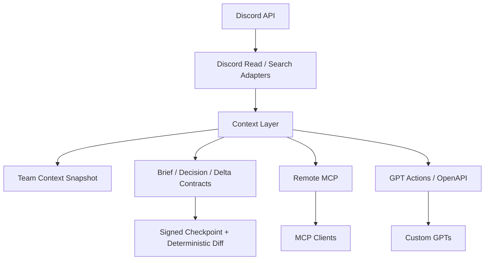

<div align="center">


<br/>

<p>
  
  
  
  
</p>

<p>
  
  
  
  
</p>

## Discord → Evidence → Shared AI Context

Discord 대화를 AI가 안전하게 읽고 검색할 수 있도록 연결하는 **Read-only Discord → AI Context Bridge**입니다.  
Remote MCP와 GPT Actions를 통해 여러 AI 클라이언트가 동일한 Discord 근거를 활용하고, 단순 메시지 요약을 넘어 **결정·진행상황·Blocker·변경사항을 근거 중심으로 해석**할 수 있도록 설계했습니다.

<sub>Read-only Discord bridge for evidence-aware team context across MCP clients and GPT Actions.</sub>

[⚡ 빠른 시작](#-빠른-시작-quick-start) · [✨ 주요 기능](#-주요-기능-features) · [💡 활용 예시](#-활용-예시-use-cases) · [🏗 아키텍처](#-아키텍처-architecture) · [🔐 보안](#-보안-security) · [📚 문서](#-문서-docs)

</div>

---

## 👀 한눈에 보기

<table>
<tr>
<td width="33%" valign="top">

### 💬 Discord 읽기

Bot이 접근할 수 있는 채널을 조회하고, 최근 메시지와 과거 대화를 검색합니다. AI 클라이언트에는 Discord 쓰기 권한을 제공하지 않습니다.

</td>
<td width="33%" valign="top">

### 🧠 팀 컨텍스트 구성

대화를 그대로 사실로 취급하지 않고, 결정·작업·Blocker·질문·제안을 구분하는 Evidence 규칙을 적용합니다.

</td>
<td width="33%" valign="top">

### 🔌 여러 AI 클라이언트 연결

같은 Discord 근거를 Remote MCP와 GPT Actions/OpenAPI를 통해 ChatGPT, Claude 등 여러 클라이언트에서 활용할 수 있습니다.

</td>
</tr>
</table>

```text
Discord
   │
   ▼
Gyuniverse Discord Bridge
   │
   ├─ Channel / Recent Message Read
   ├─ History Search + Bounded Fallback
   ├─ Team Context Snapshot
   ├─ Decision / Brief / Delta Context
   └─ Signed Team State Checkpoint
   │
   ├──────── Remote MCP ────────► MCP Clients
   └──────── GPT Actions ───────► Custom GPTs
```

> 이 공개 저장소는 실제 운영 저장소에서 분리한 **sanitized distribution**입니다. 실제 팀원의 Identity, 비공개 Workspace 결정사항, 내부 검증 데이터 및 운영 Secret은 포함하지 않습니다.

---

## ✨ 주요 기능 (Features)

| 상태 | 기능 | 설명 |
| :---: | --- | --- |
| ✅ | Channel Listing | Bot이 접근 가능한 Discord text channel 조회 |
| ✅ | Recent Messages | 특정 채널의 최근 메시지 조회 |
| ✅ | History Search | Discord 과거 대화 검색 및 인덱스 미준비 시 recent-message fallback |
| ✅ | Team Context Snapshot | Freshness / Completeness 정보를 포함한 공통 Evidence Pack 구성 |
| ✅ | Team Brief / Delta | 팀 상태를 일관된 기준으로 요약하고 변화만 비교 |
| ✅ | Decision Baseline | 더 강한 반대 근거가 나타나기 전까지 확정 결정을 기준선으로 유지 |
| ✅ | Team State Checkpoint | 정규화된 팀 상태를 서명하고 deterministic diff 계산 |
| ✅ | Remote MCP | Bearer / OAuth 인증을 지원하는 Streamable HTTP MCP endpoint |
| ✅ | OAuth | 호환 MCP client를 위한 DCR + PKCE 지원 |
| ✅ | GPT Actions | 동일한 Discord/context 로직을 제공하는 Read-only OpenAPI adapter |

### 의도적으로 Read-only

```text
❌ Discord 메시지 작성
❌ Discord 메시지 수정
❌ Discord 메시지 삭제
```

이 프로젝트는 **팀의 대화 근거를 읽는 기능**과 **실제 협업 공간을 변경하는 기능**을 분리하는 것을 기본 원칙으로 합니다.

---

## ⚡ 빠른 시작 (Quick Start)

### 1. 설치

```bash
git clone https://github.com/4hglee-ops/gyuniverse-discord-bridge.git
cd gyuniverse-discord-bridge
pnpm install
cp .env.example .env
```

Windows PowerShell에서는 필요하면 `.env.example`을 직접 복사해 `.env`로 생성하면 됩니다.

### 2. 환경변수 설정

최소 설정값:

```dotenv
DISCORD_BOT_TOKEN=
DISCORD_GUILD_ID=
DISCORD_GUILD_NAME=
MCP_SHARED_SECRET=
PUBLIC_BASE_URL=http://localhost:3000
MCP_OAUTH_TEAM_CODE=
MCP_OAUTH_SIGNING_SECRET=
```

로컬 smoke test를 실행할 경우 선택적으로 설정:

```dotenv
DISCORD_TEST_CHANNEL_ID=
```

Secret의 실제 값은 저장소에 커밋하지 않습니다.

### 3. 실행

HTTP MCP 서버:

```bash
pnpm dev
```

stdio MCP:

```bash
pnpm mcp:stdio
```

### 4. Remote MCP 연결

배포한 서비스의 URL을 사용합니다.

```text
https://your-discord-bridge.example.com/mcp
```

Static Bearer 예시:

```powershell
$env:GYUNIVERSE_MCP_TOKEN = "<MCP_SHARED_SECRET>"
claude mcp add --transport http gyuniverse-discord https://your-discord-bridge.example.com/mcp --header "Authorization: Bearer $env:GYUNIVERSE_MCP_TOKEN"
```

OAuth를 지원하는 hosted MCP client는 동일한 `/mcp` endpoint와 authorization-server discovery flow를 사용할 수 있습니다.

### GPT Actions

OpenAPI endpoint:

```text
https://your-discord-bridge.example.com/api/gpt/openapi
```

GPT Actions용 인증에는 `MCP_SHARED_SECRET`과 분리된 `GPT_ACTIONS_API_KEY` 사용을 권장합니다.

---

## 💡 활용 예시 (Use Cases)

```text
개발 채널에서 오늘 중요했던 대화를 요약해줘.
```

```text
배포 관련 논의를 Discord 전체 기록에서 찾아서 시간순 근거와 함께 보여줘.
```

```text
현재 확정된 결정, 제안, 진행 중 작업, Blocker, 미해결 질문을 구분해서 정리해줘.
```

```text
이전 Team State Checkpoint와 현재 상태를 비교해서 의미 있는 변화만 보여줘.
```

단순한 "대화 요약"보다 **무엇이 확정되었고, 무엇이 아직 제안인지, 어떤 근거가 있는지**를 구분하는 활용을 목표로 합니다.

---

## 🧠 Context Model

이 프로젝트의 핵심 해석 원칙은 다음과 같습니다.

```text
conversation ≠ decision
proposal ≠ commitment
role ≠ assignment
message saying "done" ≠ verified completion
```

즉, 누군가 Discord에서 언급했다는 이유만으로 이를 확정 사실로 취급하지 않습니다.

AI client에는 raw Discord evidence와 함께 명시적인 workflow contract를 전달하여, **보수적이고 추적 가능한 해석**을 할 수 있도록 합니다.

```text
Discord Evidence
      ↓
Snapshot + Freshness / Completeness
      ↓
Evidence-aware Interpretation
      ↓
Decisions / Work / Blockers / Questions / Proposals
      ↓
Signed Checkpoint
      ↓
Deterministic Diff
```

---

## 🏗 아키텍처 (Architecture)



### Tech Stack

| 영역 | 기술 |
| --- | --- |
| Language | TypeScript |
| Discord | discord.js |
| MCP | `@modelcontextprotocol/server`, `@modelcontextprotocol/node` |
| Validation | Zod |
| Runtime | Node.js |
| Package Manager | pnpm |
| Deployment | Vercel-compatible HTTP Functions |
| License | Apache-2.0 |

---

## 🔐 보안 (Security)

다음 값은 저장소에 커밋하지 않습니다.

```text
Discord Bot Token
MCP_SHARED_SECRET
MCP_OAUTH_TEAM_CODE
MCP_OAUTH_SIGNING_SECRET
GPT_ACTIONS_API_KEY
```

운영 환경에서는 다음 원칙을 권장합니다.

- Discord Bot에는 필요한 최소 Read 권한만 부여
- Static Bearer, OAuth 승인 코드, Token Signing Secret을 서로 분리
- 실제 Workspace의 Identity Map과 Decision Data는 공개 저장소 외부에서 관리
- Secret 노출이 의심되면 즉시 폐기 및 재발급
- AI client에는 Discord write/edit/delete 기능을 제공하지 않음

세부 내용은 [`SECURITY.md`](SECURITY.md)를 참고하세요.

---

## 🧪 검증 (Validation)

기본 정적 검증:

```bash
pnpm install
pnpm typecheck
```

실제 Discord 연결 검증은 본인이 관리하는 Discord server와 별도 credential을 사용해 Read-only smoke test로 수행합니다.

이 공개 저장소는 공개 전 Git history privacy/secret 검사를 거쳐 실제 팀 데이터와 운영용 식별자를 제거했습니다. 공개 배포 전 점검 항목은 [`PUBLIC_RELEASE_CHECKLIST.md`](PUBLIC_RELEASE_CHECKLIST.md)에서 확인할 수 있습니다.

---

## 📚 문서 (Docs)

| 문서 | 목적 |
| --- | --- |
| [`TEAM_AI_CONNECTION_QUICKSTART.md`](docs/TEAM_AI_CONNECTION_QUICKSTART.md) | Self-hosted AI client 연결 가이드 |
| [`GPT_INSTRUCTIONS.md`](docs/GPT_INSTRUCTIONS.md) | Evidence-aware GPT instruction template |
| [`TEAM_CONTEXT_SNAPSHOT.md`](docs/TEAM_CONTEXT_SNAPSHOT.md) | Snapshot 및 completeness/freshness 모델 |
| [`TEAM_CONTEXT_SKILL.md`](docs/TEAM_CONTEXT_SKILL.md) | 공통 Team Context workflow 규칙 |
| [`TEAM_COLLABORATION_WORKFLOWS.md`](docs/TEAM_COLLABORATION_WORKFLOWS.md) | Decision / Task / Blocker 해석 모델 |
| [`TEAM_STATE_CHECKPOINTS.md`](docs/TEAM_STATE_CHECKPOINTS.md) | Signed Checkpoint와 deterministic diff 설계 |
| [`DECISION_BASELINE.example.md`](docs/DECISION_BASELINE.example.md) | 공개용 fictional Decision Baseline 예시 |
| [`CHANGELOG.md`](CHANGELOG.md) | 주요 개발 과정과 변화 기록 |

---

## 🗺 Roadmap

**현재 (Current)**  
`Discord Read → Search → Evidence Context → Checkpoint / Delta`

**다음 단계 (Next)**  
Thread / Reply 기반 Evidence 강화, persistent checkpoint store, 사용자별 identity 강화, 외부 협업도구와의 reconciliation 확장.

**장기 방향 (Long-term)**  
Discord를 단순 채팅 로그가 아니라 여러 협업 도구 중 하나의 **Evidence Source**로 활용하여, AI가 팀의 현재 상태를 근거 기반으로 이해할 수 있는 Context Layer로 확장하는 것을 목표로 합니다.

---

## 📄 License

Apache License 2.0

[`LICENSE`](LICENSE)에서 전체 라이선스 내용을 확인할 수 있습니다.

---

<div align="center">


### 🌌 Gyuniverse

**Discord 대화 → Shared Context → 더 나은 팀 의사결정**

<sub>Open-source · Self-hosted · Read-only Discord Context Infrastructure</sub>

</div>
