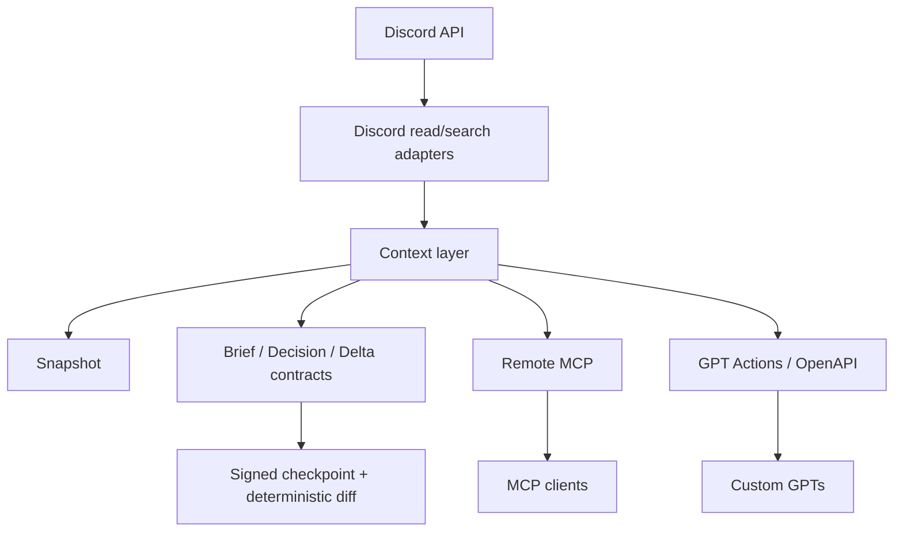

<div align="center">


<br/>

<p>
  
  
  
  
</p>

<p>
  
  
  
  
</p>

**Discord → Evidence → Shared AI Context**  
A read-only Discord bridge that lets AI clients search team conversations, build evidence-aware context, compare team state, and connect through Remote MCP or GPT Actions.

[⚡ Quick Start](#-quick-start) · [✨ Features](#-features) · [💡 Use Cases](#-use-cases) · [🏗 Architecture](#-architecture) · [🔐 Security](#-security) · [📚 Docs](#-docs)

</div>

---

## 👀 At a glance

<table>
<tr>
<td width="33%" valign="top">

### 💬 Read Discord

List accessible channels, read recent messages, and search conversation history without giving AI clients Discord write permissions.

</td>
<td width="33%" valign="top">

### 🧠 Build Team Context

Use evidence rules to distinguish decisions, tasks, blockers, risks, questions, and proposals instead of treating every message as a fact.

</td>
<td width="33%" valign="top">

### 🔌 Use Multiple AI Clients

Expose the same Discord evidence through Remote MCP and a GPT Actions/OpenAPI adapter.

</td>
</tr>
</table>

```text
Discord
   │
   ▼
Gyuniverse Discord Bridge
   │
   ├─ Channel / recent-message reads
   ├─ History search + bounded fallback
   ├─ Team Context Snapshot
   ├─ Decision / Brief / Delta context
   └─ Signed Team State Checkpoints
   │
   ├──────── Remote MCP ────────► MCP clients
   └──────── GPT Actions ───────► Custom GPTs
```

> This public repository is a sanitized distribution. Production-specific identities, private workspace decisions, and internal validation data are intentionally excluded.

---

## ✨ Features

| Status | Feature | Description |
| :---: | --- | --- |
| ✅ | Channel listing | Lists Discord text channels accessible to the configured bot |
| ✅ | Recent messages | Reads recent messages from one channel |
| ✅ | History search | Searches Discord history with local recent-message fallback when indexing is unavailable |
| ✅ | Team Context Snapshot | Builds a shared evidence pack with freshness and completeness metadata |
| ✅ | Team Brief / Delta contracts | Provides a consistent interpretation contract for team-state summaries |
| ✅ | Decision Baseline | Preserves confirmed decisions until stronger superseding evidence exists |
| ✅ | Team State Checkpoints | Signs normalized team state and computes deterministic diffs |
| ✅ | Remote MCP | Streamable HTTP MCP endpoint with bearer/OAuth authentication |
| ✅ | OAuth | DCR + PKCE support for compatible hosted MCP clients |
| ✅ | GPT Actions | Read-only OpenAPI adapter over the same Discord/context logic |

### Intentionally read-only

```text
❌ create Discord messages
❌ edit Discord messages
❌ delete Discord messages
```

The bridge separates **reading team evidence** from **mutating the team workspace**.

---

## ⚡ Quick Start

### 1. Install

```bash
git clone https://github.com/4hglee-ops/gyuniverse-discord-bridge.git
cd gyuniverse-discord-bridge
pnpm install
cp .env.example .env
```

### 2. Configure

At minimum:

```dotenv
DISCORD_BOT_TOKEN=
DISCORD_GUILD_ID=
DISCORD_GUILD_NAME=
MCP_SHARED_SECRET=
PUBLIC_BASE_URL=http://localhost:3000
MCP_OAUTH_TEAM_CODE=
MCP_OAUTH_SIGNING_SECRET=
```

For local smoke tests, optionally set:

```dotenv
DISCORD_TEST_CHANNEL_ID=
```

### 3. Run

```bash
pnpm dev
```

or stdio MCP:

```bash
pnpm mcp:stdio
```

### 4. Connect a Remote MCP client

Use your own deployment URL:

```text
https://your-discord-bridge.example.com/mcp
```

Static bearer example:

```powershell
$env:GYUNIVERSE_MCP_TOKEN = "<MCP_SHARED_SECRET>"
claude mcp add --transport http gyuniverse-discord https://your-discord-bridge.example.com/mcp --header "Authorization: Bearer $env:GYUNIVERSE_MCP_TOKEN"
```

OAuth-capable hosted clients can use the same `/mcp` endpoint with the server's protected-resource / authorization-server discovery flow.

### GPT Actions

OpenAPI endpoint:

```text
https://your-discord-bridge.example.com/api/gpt/openapi
```

Use a separate `GPT_ACTIONS_API_KEY` for the Actions adapter.

---

## 💡 Use Cases

```text
Summarize the most important messages from the engineering channel.
```

```text
Search Discord history for the deployment discussion and show the evidence in chronological order.
```

```text
Separate confirmed decisions, proposals, in-progress work, blockers, and unanswered questions.
```

```text
Compare the current normalized team state with the previous checkpoint and show only meaningful changes.
```

---

## 🧠 Context model

The bridge is designed around a simple rule:

```text
conversation ≠ decision
proposal ≠ commitment
role ≠ assignment
message saying “done” ≠ verified completion
```

AI clients receive raw Discord evidence plus explicit workflow contracts so they can make conservative, traceable interpretations.

```text
Discord Evidence
      ↓
Snapshot + freshness/completeness
      ↓
Evidence-aware interpretation
      ↓
Decisions / Work / Blockers / Questions / Proposals
      ↓
Signed Checkpoint
      ↓
Deterministic Diff
```

---

## 🏗 Architecture



### Tech Stack

| Layer | Technology |
| --- | --- |
| Language | TypeScript |
| Discord | discord.js |
| MCP | `@modelcontextprotocol/server`, `@modelcontextprotocol/node` |
| Validation | Zod |
| Runtime | Node.js |
| Package manager | pnpm |
| Deployment | Vercel-compatible HTTP functions |

---

## 🔐 Security

Do not commit:

```text
Discord Bot Token
MCP_SHARED_SECRET
MCP_OAUTH_TEAM_CODE
MCP_OAUTH_SIGNING_SECRET
GPT_ACTIONS_API_KEY
```

Production recommendations:

- keep the Discord bot read-only and least-privileged
- use separate secrets for static bearer access, OAuth approval, and token signing
- keep workspace-specific identity maps and decision data outside the public repository
- rotate credentials immediately after suspected exposure

See [`SECURITY.md`](SECURITY.md).

---

## 🧪 Validation

```bash
pnpm install
pnpm typecheck
```

Then run local read-only smoke tests against a Discord server you control.

Before publishing or forking into a public workspace, review [`PUBLIC_RELEASE_CHECKLIST.md`](PUBLIC_RELEASE_CHECKLIST.md).

---

## 📚 Docs

| Document | Purpose |
| --- | --- |
| [`TEAM_AI_CONNECTION_QUICKSTART.md`](docs/TEAM_AI_CONNECTION_QUICKSTART.md) | Self-hosted client connection guide |
| [`GPT_INSTRUCTIONS.md`](docs/GPT_INSTRUCTIONS.md) | Generic evidence-aware GPT instruction template |
| [`TEAM_CONTEXT_SNAPSHOT.md`](docs/TEAM_CONTEXT_SNAPSHOT.md) | Snapshot model and completeness semantics |
| [`TEAM_CONTEXT_SKILL.md`](docs/TEAM_CONTEXT_SKILL.md) | Shared Team Context workflow rules |
| [`TEAM_COLLABORATION_WORKFLOWS.md`](docs/TEAM_COLLABORATION_WORKFLOWS.md) | Decision / task / blocker interpretation model |
| [`TEAM_STATE_CHECKPOINTS.md`](docs/TEAM_STATE_CHECKPOINTS.md) | Checkpoint and deterministic diff design |
| [`DECISION_BASELINE.example.md`](docs/DECISION_BASELINE.example.md) | Fictional baseline example for public use |
| [`CHANGELOG.md`](CHANGELOG.md) | Public development journey |

---

## 🗺 Roadmap

**Current**  
`Discord Read → Search → Evidence Context → Checkpoint / Delta`

**Next**  
Thread/reply evidence, persistent checkpoint store, stronger per-user identity, broader reconciliation adapters.

**Long-term direction**  
Use Discord as one evidence source in a wider AI-assisted team-state layer without turning the bridge into an uncontrolled workspace writer.

---

<div align="center">


### 🌌 Gyuniverse

**Discord conversations → Shared context → Better team decisions**

<sub>Open-source, self-hosted, read-only Discord context infrastructure.</sub>

</div>
